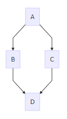

# Redmine Mermaid Macro Plugin

> [RedMica UI Extension](https://github.com/redmica/redmica_ui_extension) is a more functional plugin.

This plugin adds a `mermaid` graph macro to wiki formated fields.

About mermaid: https://mermaid.js.org/

## Example

```
{{mermaid
graph TD;
    A-->B;
    A-->C;
    B-->D;
    C-->D;
}}
```



## Installation

1. Clone or copy files into the Redmine plugins directory
   ```
   // < v10
   git clone -b mermaid9 https://github.com/taikii/redmine_mermaid_macro.git plugins/redmine_mermaid_macro

   // >= v10
   git clone -b mermaid10 https://github.com/taikii/redmine_mermaid_macro.git plugins/redmine_mermaid_macro
   ```
2. Restart Redmine

## Configration

You can configure `mermaid.js` URL on `Administration -> Plugins` page.
Default value is UNPKG CDN.
https://unpkg.com/mermaid/dist/mermaid.min.js

## License

[MIT](LICENSE)
